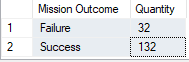
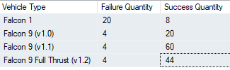
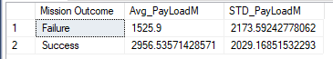

__Introduction__

The dataset is pulled from Kaggle.  I am particular interested in finding what would contribute to the failure outcome of a mission. 

__Results / Analysis__

There are 75.75% of success rate.  The failure rate is due to dollision during launch.  

