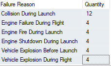

__Introduction__

The dataset is pulled from Kaggle.  I am particular interested in finding what would contribute to the failure outcome of a mission. 

__Results / Analysis__

There are 75.75% of success rate.  The failure rate is due to collision during launch (Table 2).  There are 4 vehicle types used for mission; Falcon 1 has the highest failure rate compares to other 3 vehicles.  Falcon 9 (v1.1) has the highest success count.  All the collision during launch have the Falcon 1 as the Vehicle Type.

__Table 2:__

__Table 3:__

What makes Falcon 1 different from other vehicles?

